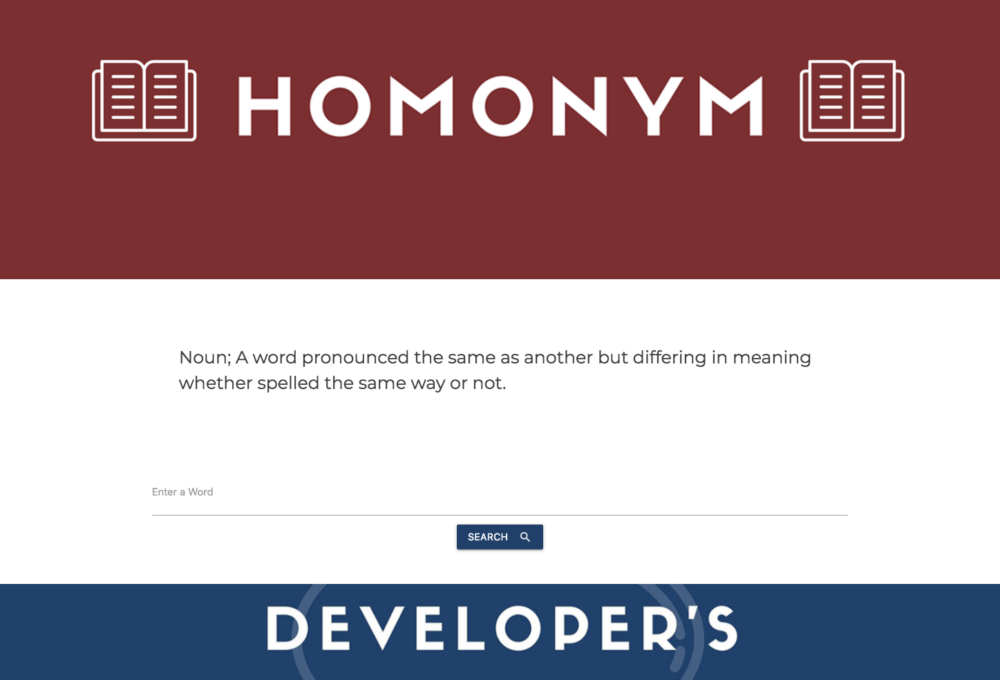
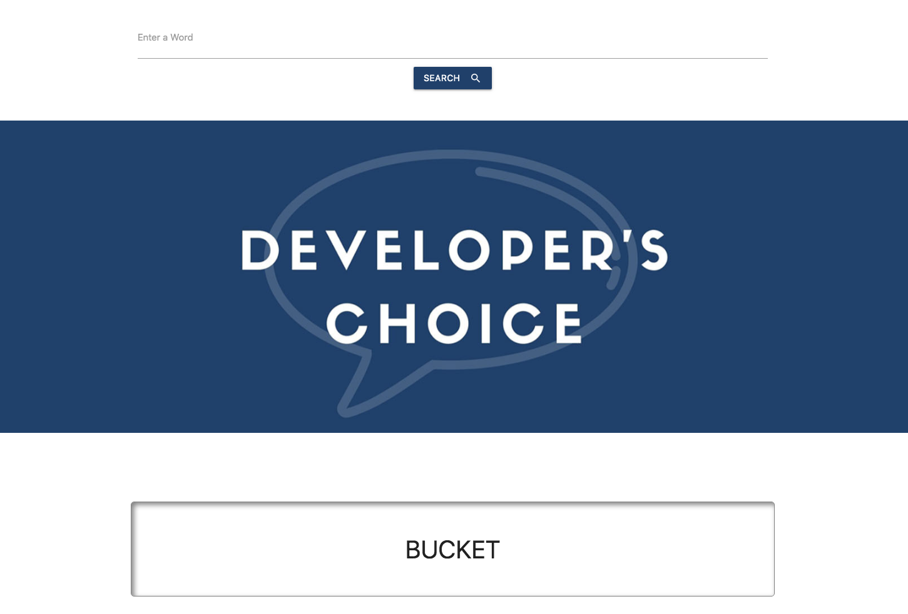

# Homonym Say What?! 

## Team: WMSN Develop Group

[GitHub Live Site](https://)

## Project Overview

In this project, our team is building a responsive application where users can search for a word to retrieve a definition from the Merrian Webster Dictionary, and a definition from the Urban Dictionary. The result will show the users the real definition of the word as well as a slang definition.

## Languages and Libraries:

* HTML
* CSS
* JavaScript
* jQuery
* Google
* W3school
* API's (dictionary.com and urbandictionary.com)
* Node
* Materialize 

## User story:

Slang! It's for everyone! Whether you're an old school kool cat trying to pick up on the latest trends, an out of touch parent trying to decipher what your childern are saying to you. "Homonym, Say What?" is here for you. We specialize in helping find the true meaning of these new word trends and the most up to date slang versions in one simple search! With "Homonym Say What?" you'll never be out of the loop again!

## User Functionality:
User can enter their search word to get the top two definitions from both dictionaries.
User can also select a predetermined word from our Developer's Choice
​
## Process:
This project fulfills the following requirements:
​
* Use a CSS framework other than Bootstrap.
​
* Deploy to GitHub Pages.
​
* Be interactive (i.e., accept and respond to user input).
​
* Use at least two server-side APIs.
​
* Does not use alerts, confirms, or prompts (use modals).
​
* Use client-side storage to store persistent data.

* Be responsive.
​
* Have a polished UI.
​
* Have a clean repository that meets quality coding standards (file structure, naming conventions, follows best practices for class/id naming conventions, indentation, quality comments, etc.).
​
* Have a quality README (with unique name, description, technologies used, screenshot, and link to deployed application).
​
## Developers:

### William Chenausky   
* Github: https://github.com/wchenausky  
* Contact: williamchenausky@yahoo.com

### Marisa NeSmith   
* Github: https://github.com/marisanesmith   
* Contact: marisanesmith@yahoo.com

### Nicholas Podniestrzanski 
* Github:  https://github.com/Nickpodski 
* Contact: nickpodski@gmail.com

### Shuting Zhao  
* Github: https://github.com/zst199394  
* Contct: zst9394@outlook.com