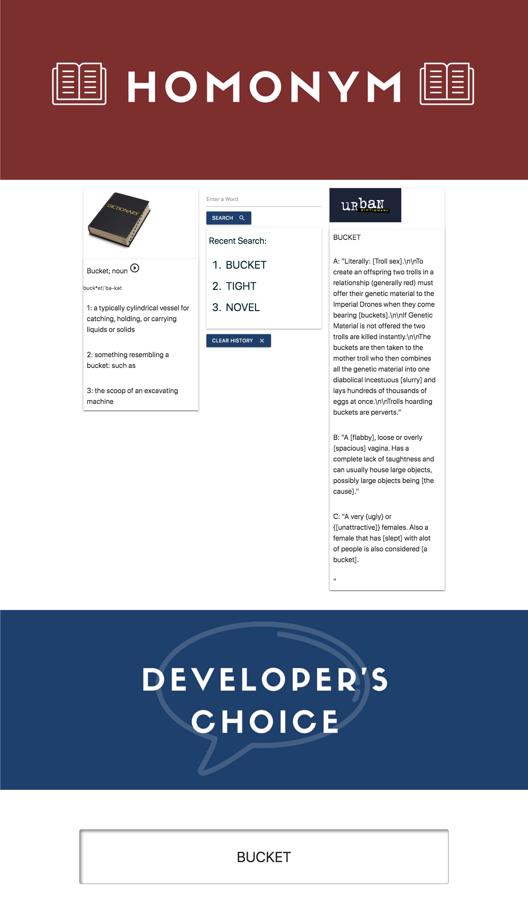

# Homonym Say What?! 

## Team: WMSN Develop Group

## Project Overview

In this project, our team is building a responsive application where users can search for a word to retrieve a definition from the Merrian Webster Dictionary, and a definition from the Urban Dictionary. The result will show the users the real definition of the word as well as a slang definition.

## Languages and Libraries:

* HTML
* CSS
* JavaScript
* jQuery
* API's (dictionary.com and urbandictionary.com)
* Materialize CSS Framework

## User story:

Slang! It's for everyone! Whether you're an old school kool cat trying to pick up on the latest trends, an out of touch parent trying to decipher what your childern are saying to you. "Homonym, Say What?" is here for you. We specialize in helping find the true meaning of these new word trends and the most up to date slang versions in one simple search! With "Homonym Say What?" you'll never be out of the loop again!

## Direction for Future Development

* Be able to add in searchable phrases which will display definitions from both API's
* Links to the websites that they are linked to
* Make the bracketed words that are displayed in Urban Dictionary definition to be clickable displaying a new definition for that word
* If the definition is longer we will make a model or pagination that will display the entire definition.
* Display an actual random word and not one that is preselected by our developer

## User Functionality:
User can enter their search word to get the top two definitions from both dictionaries.
User can also select a predetermined word from our Developer's Choice

[GitHub Live Site](https://wchenausky.github.io/project-1/)

## Developers:

### William Chenausky   
* Github: https://github.com/wchenausky  
* Contact: williamchenausky@yahoo.com

### Marisa NeSmith   
* Github: https://github.com/marisanesmith   
* Contact: marisanesmith@yahoo.com

### Nicholas Podniestrzanski 
* Github:  https://github.com/Nickpodski 
* Contact: nickpodski@gmail.com

### Shuting Zhao  
* Github: https://github.com/zst199394  
* Contct: zst9394@outlook.com